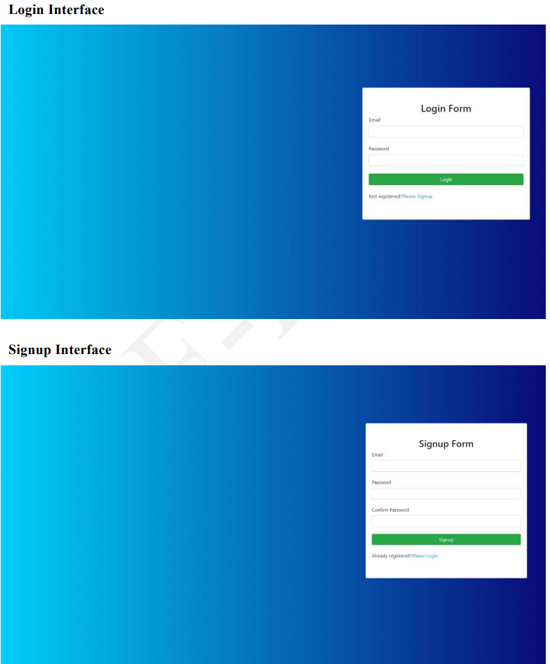
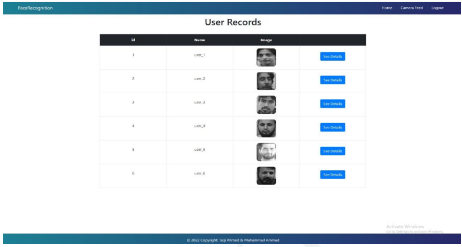
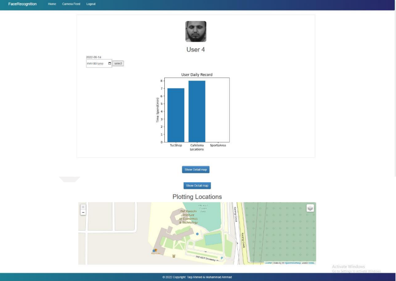

# Location Tracking | Face Recognition

this project is a Location Monitoring System through Face Recognition. In which
we  track and save the locations visited by a person in any particular building. On the main entrance, in case of arrival of an unknown person we take some pictures and save these
pictures as a dataset, also we perform training on that generated dataset and a system
generate id is assigned to that person. After that, we  calculate the distance of that
person from the camera and with the help of this distance, we  find out the latitude and
longitude and plot them on the map.

## Objectives

- Face detection and recognition.
- Generate dataset of unknown person.
- Training on dataset of unknown person.
- Tracks Visited Locations.
- Keeps Record of Time Spend on a Location.
- Distance, latitude and longitude Calculation
- Plot Latitude and Longitude on Map
- Prediction of Next Location to be Visited
- All these task will be done on real time with date and time.
## Tools And Languages

- Python
- Opencv
- Sql Server
- Machine Learning Algorithms(logistic regression, decision trees, knn)
- Face Recognition library
- pyodbc
- Vscode
## Project Working
### Login and signup

### HomePage

### UserDetail Page

### Camera Page

